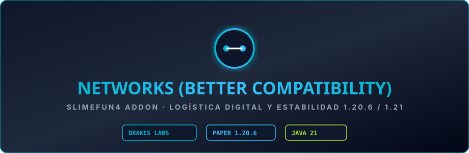

  

# Networks - Better Compatibility (Unofficial)

Fork de compatibilidad y estabilización de **Networks** para **Slimefun 4**, adaptado por **DrakesCraft Labs** para Paper 1.20.6 / 1.21.11 en Java 21.

---

## 🎯 Mejoras Clave en esta Versión

- **Estabilidad de Inicialización**: Corrección de fallos en el orden de inicialización estática que producían `NullPointerException` al cargar ítems core de Slimefun.
- **Mapeo de NMS y Partículas**: Adaptación de identificadores de encantamientos, efectos y partículas para Minecraft moderno.
- **Rendimiento de Red**: Optimización en los algoritmos de escaneo de cables y celdas de almacenamiento.

---

## 🛠️ Entorno y Dependencias

- **Servidor**: Paper / Purpur 1.20.6 - 1.21.11
- **Java**: 21
- **Dependencias**:
  - `Slimefun4-Drake`
